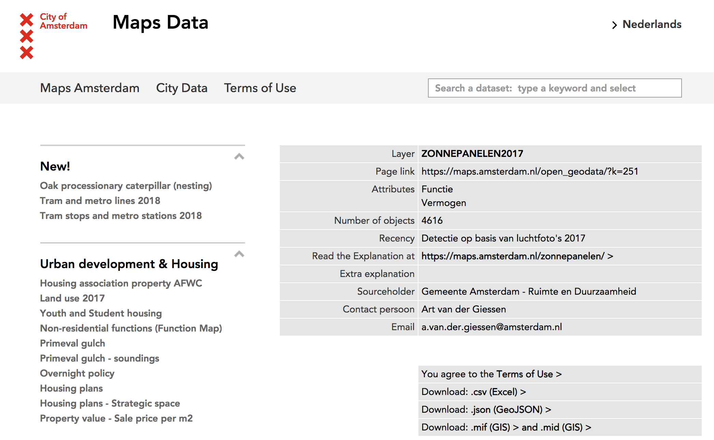
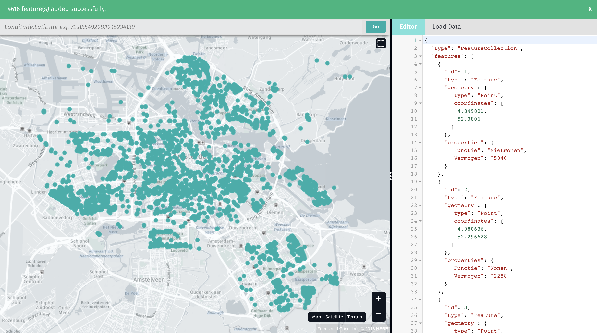
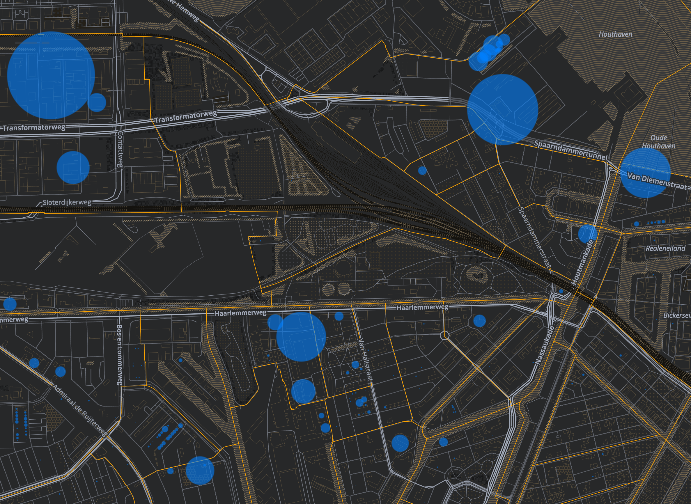

# Making a Map with XYZ

## Overview
Duration: 2:00

In this tutorial, you will learn to access data in a the HERE XYZ Space to make a map.

### What you'll learn

- How to view data from an XYZ Space on a map
- How to upload, tag and view larger GeoJSON files
- How to view XYZ Space geodata in a variety of mapping tools.


## Viewing data from an XYZ Space using the GeoJSON Viewer
Duration: 5:00

- open the [GeoJSON Viewer](http://geojson.tools/index.html)
- open this URL by clicking on the Load Data tab and copying and pasting this into the 'From GeoJSON URL' option:
`https://xyz.api.here.com/hub/spaces/x-india-trains/iterate?limit=50&access_token=Qz2TvilK6PhGZSu9K-yGkA`

You should see a map like this:


Note you can also append the data URL to the end of the GeoJSON viewer:
`http://geojson.tools/index.html?url=https://xyz.api.here.com/hub/spaces/x-india-trains/iterate?limit=50&access_token=Qz2TvilK6PhGZSu9K-yGkA`


## Access an XYZ Space via the vector tiles endpoint
Duration: 10:00

### Viewing an XYZ Space using Web Mercator vector tiles

To access an XYZ Space as GeoJSON vector tiles in a renderer like [Tangram](https://tangrams.readthedocs.io/en/latest/), the syntax of the URL would look like this:

`https://xyz.api.here.com/hub/spaces/SPACE_ID/tile/web/{z}_{x}_{y}?access_token=YOUR_TOKEN_ID`


_Note: Map tile renders will automatically fill in the {x}, {y} and {z} in order to load tiles based on longitude `{x}`, latitude `{y}` and zoom level `{z}`. A fully formed vector tile URL looks like this:_

`https://xyz.api.here.com/hub/spaces/x-india-trains/tile/web/18_184115_116960?access_token=Qz2TvilK6PhGZSu9K-yGkA&clip=true&`


Or, open this link to see [rail lines from Mumbai](https://play.tangram.city/?scene=https://s3.amazonaws.com/xyz-demo/data/india_trains.yaml#4.858/22.234/76.860) served as vector tiles and rendered by Tangram.


### Tangram scene files (YAML)

To access XYZ vector tiles in a Tangram scene file, your `source:` block would look like this:

```
sources:
    rail_from_mumbai:
        url: https://xyz.api.here.com/hub/spaces/YOUR_SPACE_ID/tile/web/{z}_{x}_{y}
        url_params:
            access_token: YOUR_ACCESS_TOKEN
            clip: true
        type: GeoJSON

```

Don't forget to paste in your own XYZ space ID and access token!

Learn more about getting data via [tiles](https://xyz.api.here.com/hub/static/swagger/#/Read_Features/getFeaturesByTile)

_Note: it is important to include `clip: true` with vector tile renders, especially when using linestrings or polygons, otherwise each tile will contain the entire geometry of objects it intersects._

_Note: If you have previously worked with vector tiles, you may be used to an `{z}/{x}/{y}` URL schema. The XYZ API uses underscores instead of slashes: `tile/web/{z}_{x}_{y}`_

## Upload GeoJSON to make a map with Tangram and XYZ vector tiles
Duration: 30:00

In this exercise, you will download data from the [Amsterdam Open Data portal](https://maps.amsterdam.nl/open_geodata/?LANG=en), upload and tag them to an XYZ Space, and build a map in Tangram.

First, download solar panel, green roof, GeoJSON data and quarters (neighborhood) data from https://maps.amsterdam.nl/open_geodata/?LANG=en



You can preview the GeoJSON by opening one of the files into [geojson.tools](https://geojson.tools) to preview.



Now you will make a new space via the XYZ CLI:

    here xyz create -t "Amsterdam open data" -d "Amsterdam open data via https://maps.amsterdam.nl/open_geodata/?LANG=en"
    
Make note of the XYZ spaceID returned by the CLI.

Upload and tag the GeoJSON files using the CLI:

    here xyz upload YOURSPACEID -f GROENE_DAKEN.json -t green_roof
    here xyz upload YOURSPACEID -f ZONNEPANELEN2017.json -t solar_panels
    here xyz upload YOURSPACEID -f GEBIED_BUURTCOMBINATIES.json -t quarters
    
Open the data in the GeoJSON viewer:

    here xyz show YOURSPACEID -w
	
Copy the value of the access_token in that URL, which will look something like this:

    http://geojson.tools/index.html?url=https://xyz.api.here.com/hub/spaces/YOURSPACEID/search?limit=5000&access_token=YOUR_ACCESS_TOKEN

Open [this scene in Tangram Play](https://play.tangram.city/?scene=https://s3.amazonaws.com/xyz-demo/scenes/amsterdam_open_data/amsterdam_template.yaml#11.4292/52.3627/4.8756):
	
    https://play.tangram.city/?scene=https://s3.amazonaws.com/xyz-demo/scenes/amsterdam_open_data/amsterdam_template.yaml#11.4292/52.3627/4.8756

* use your space id to replace the SPACE_ID in the "url parameter" block in the "source" group in **line 13**
* use your token to replace the `token_id` parameter in `url_params` with your token in **line 20**
* uncomment lines 13 and 20 (delete the leading `#` or highlight the line and press `Command /`)

Your `sources` block should look like this:
	
	sources:
		_xyzspace:
			url: https://xyz.api.here.com/hub/spaces/YOURSPACEID/tile/web/{z}_{x}_{y} # ADD YOUR SPACE ID 
			clip: true
			type: GeoJSON
			url_params: 
				access_token: YOUR_ACCESS_TOKEN # CHANGE THIS TO THE TOKEN FOR YOUR SPACE ID

_Note: You may need to reload the page._

As you zoom in, neighborhoods will appear, and then the circles will become proportional, and eventually will show labels.



## Transfer a CSV to make a forest fire map
Duration: 30:00

In this tutorial, you will transfer a CSV containing 7 days worth of forest fire data from the [NASA MODIS active fire dataset](https://earthdata.nasa.gov/earth-observation-data/near-real-time/firms/active-fire-data) to an XYZ Space, and display it using vector tiles in Tangram.

1. Make a new space via the XYZ CLI
	* here xyz create -t "NASA/NOAA MODIS fire data" -d "https://earthdata.nasa.gov/earth-observation-data/near-real-time/firms/active-fire-data"
	* make note of the XYZ spaceID returned by the CLI

2. Upload the 7 day MODIS file to the XYZ space using the source data URL:
	* `here xyz upload SPACEID -f "https://firms.modaps.eosdis.nasa.gov/active_fire/c6/text/MODIS_C6_Global_7d.csv" -p acq_date -t modis`
	* _Note: `-p` is using the `acq_date` property and assigning that value as a tag, while `-t` is assigning `modis` as a tag to every feature._
	* _Note: this is taking the CSV of active fire observations from NASA and transferring it directly to an XYZ space, 100 at a time, without having to download it to your desktop and then upload it._

3. Open the data in the GeoJSON Viewer:
	* `here xyz show YOURSPACEID -w`

4. Copy the value of the `access_token` parameter in that URL

5. [Open this scene](https://play.tangram.city/?scene=https://s3.amazonaws.com/xyz-demo/scenes/active_fire_data/fires_modis_xyz_24.yaml#8.000/39.192/-121.487) in Tangram Play
	* https://play.tangram.city/?scene=https://s3.amazonaws.com/xyz-demo/scenes/active_fire_data/fires_modis_xyz_24.yaml#8.000/39.192/-121.487


6. Use your space id to replace the SPACEID in the "url parameter" in the "source" group in **line 155**

7. use your access token to replace the `access_token` parameter in `url_params` **line 158**

   Your source block should look something like this:

	```
    modis_fires:
        url: https://xyz.api.here.com/hub/spaces/ZOaZln0t/tile/web/{z}_{x}_{y}
        url_params:
            access_token: YOUR_TOKEN_ID
            clip: true
        type: GeoJSON
	```
	(You may need to reload but hopefully not.)

8. this represents the last 7 days of global active fire data as observed by NASA's MODIS satellite
	* each color change represents a 24 hour slice of data -- brighter colors are newer data
	* MODIS data is constantly updating as satellites orbit, so you could upload this file every day (or every hour) and the changes would be uploaded to the XYZ space without duplicating the data


9. you can use tags to filter fire data by day: in the `modis_fires` section of the `sources` block, add this line directly below `clip` in `url_params`
	`tags: 2018%2D08%2D20``
	
	Your source block should look something like this:

	```
    modis_fires:
        url: https://xyz.api.here.com/hub/spaces/ZOaZln0t/tile/web/{z}_{x}_{y}
        url_params:
            access_token: YOUR_TOKEN_ID
            clip: true
            tags: 2018%2D08%2D20
        type: GeoJSON
	```

10. Pan around the map to look for fires. Depending on the season, you may see fires in California, British Columbia, Portugal, Siberia or Australia. Other hotspots include oil well flares in Iraq, agricultural burning in Central Africa, clear cutting in Brazil, and industrial hotspots world-wide (power plants, factories).
