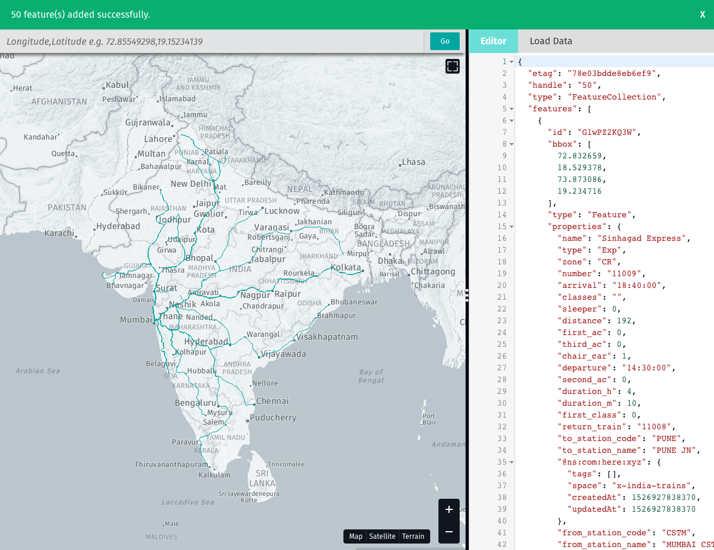

# Using the HERE XYZ CLI

## Overview
Duration: 5:00

The *HERE XYZ CLI* enables you to upload, access, and inspect geodata in XYZ Spaces via the command line interface. In this tutorial, you will learn how to:

* authenticate the CLI with your HERE credentials
* create an XYZ Space
* upload GeoJSON to an XYZ Space
* add tags to data being uploaded to an XYZ Space
* convert and upload other geodata formats (CSV, shapefiles)
* inspect geodata and tags in an XYZ Space
* clear features and delete XYZ Spaces
* open an XYZ Space in a web browser
* mint tokens to access XYZ Spaces

(If you haven't yet installed the XYZ CLI, please see the "Installing the XYZ command line" section of this codelab.)

### HERE credentials:

If you haven't already registered for an XYZ account on xyz.here.com/studio, do so now.

Enter your email credentials by typing:

    here configure account

(You will be prompted to enter your email address and password. Your email will be echoed, but there will be no feedback when you paste in your password.)

### About GeoJSON data


GeoJSON is a format that encodes geographic data and is based on JSON. Below is a sample file that encodes locations of a few HERE offices.

HERE XYZ is able to read GeoJSON natively (and can also convert and upload CSVs with latitude/longitude coordinates, and shapefiles/SHP into XYZ Spaces).


```
{
  "type": "FeatureCollection",
  "features": [
    {
      "type": "Feature",
      "properties": {
        "name": "HERE Mumbai"
      },
      "geometry": {
        "type": "Point",
        "coordinates": [
          72.87471771240234,
          19.1261935786045
        ]
      }
    },
    {
      "type": "Feature",
      "properties": {
        "name": "HERE Frankfurt (Schwalbach)"
      },
      "geometry": {
        "type": "Point",
        "coordinates": [
          8.53463888168335,
          50.161422225576295
        ]
      }
    },
    {
      "type": "Feature",
      "properties": {
        "name": "HERE Chicago"
      },
      "geometry": {
        "type": "Point",
        "coordinates": [
          -87.63907670974731,
          41.88441938739452
        ]
      }
    }
  ]
}
```


Click this link to save the following to your desktop as xyz.geojson. [Download: GeoJSON](https://s3.amazonaws.com/xyz-demo/data/xyz.geojson)


## Create a new XYZ Space
Duration: 5:00

On the command line, use the `create` option to make a new XYZ Space and give it a title and description.


    here xyz create -t "my new xyz space" -d "a new space with xyz.geojson"


If successfully executed, your output will be:


    xyzspace 'YOUR_SPACE_ID' created successfully


The CLI will return the unique ID of your XYZ Space. Keep track of this ID as you'll need it to upload data, and to view GeoJSON onto a map.

_Hint: You can review all of your XYZ Spaces by typing `$ here xyz list`_

## Uploading data to your XYZ Space
Duration: 5:00

Now we'll upload GeoJSON to an XYZ Space. Use `-f` to specify a file.

    here xyz upload SPACE_ID -f xyz.geojson

(`cd` to the directory where you downloaded the data. On a Mac, you can drag the file to the terminal window after `-f `.)

The CLI will return a summary of the GeoJSON file you uploaded, including a count of features, and their geometry type.

    data upload to xyzspace 'MZZodRsb' completed successfully
    ==========================================================
                      Upload Summary                     
    ==========================================================
    Total 4 features
    GeometryType  Count
    ------------  -----
    Point         4    


_Note: the `upload` command will check and warn you about duplicate values in your file, and will not duplicate identical features already in the XYZ Space. You can override this using `-o`._

## Adding tags to features while uploading to an XYZ Space

You can add a tag to features while uploading them to an XYZ space. This makes it easier to filter this data when requesting it from the API, especially when you are uploading data from multiple sources.

When uploading data, use the `-t` option followed by the tag you want to add. (You can append multiple tags using a comma.)

    here xyz upload SPACE_ID -f xyz.geojson -t xyzweek,codelab
    
This tag will be added to every feature. 

In addition to a count of objects, the CLI will show you a list of unique tags.


    data upload to xyzspace 'MZZodRsb' completed successfully
    ==========================================================
                      Upload Summary                     
    ==========================================================
    Total 4 features
    GeometryType  Count
    ------------  -----
    Point         4    

    Total unique tag Count : 3
    Unique tag list  :["xyzweek","codelab","xyz"]
    TagName  Count
    -------  -----
    xyzweek  4    
    codelab  4    
    xyz      4    here x

_Note that XYZ will also add the filename as a tag to make it easier to track multiple uploads, and back out an upload, if necessary._


## Assigning the value of GeoJSON properties as a tag
Duration: 15:00

### Assigning the value of a GeoJSON property using -p

You can assign the value of a GeoJSON property as a tag using `-p`. (This is most useful when there are a reasonable number of discrete values. As an example, a set of road classifications would make good tags, while length of roads would not.)

Download [this file of airports](https://s3.amazonaws.com/xyz-demo/data/offices.geojson) from [Natural Earth](http://www.naturalearthdata.com/):

	https://raw.githubusercontent.com/nvkelso/natural-earth-vector/master/geojson/ne_10m_airports.geojson

This GeoJSON file includes various properties, including the type of the airport. Here's a single feature in that GeoJSON file showing Schipol, Amsterdam's airport.

      "properties": {
        "abbrev": "AMS", 
        "featurecla": "Airport", 
        "gps_code": "EHAM", 
        "iata_code": "AMS", 
        "location": "terminal", 
        "name": "Schiphol", 
        "natlscale": 150, 
        "scalerank": 2, 
        "type": "major", 
        "wikipedia": "http://en.wikipedia.org/wiki/Amsterdam_Schiphol_Airport"
      }

You can assign the country of this office to be a tag using `-p country`:

    here xyz upload SPACE_ID -f ne_10m_airports.geojson -p type
    
Note you can also load data directly via URL:

    here xyz upload SPACE_ID -f "https://raw.githubusercontent.com/nvkelso/natural-earth-vector/master/geojson/ne_10m_airports.geojson" -p type

After the data has been loaded into the XYZ space, a list and count of unique tags generated:

	data upload to xyzspace 'zcispwpB' completed successfully
	==========================================================
						 Upload Summary                     
	==========================================================
	Total 891 features
	
	GeometryType  Count
	------------  -----
	Point         891  

	Total unique tag Count : 19
	Unique tag list  :["small","type@small","ne_10m_airports","mid","type@mid","mid_and_military","type@mid_and_military","major_and_military","type@major_and_military","military_mid","type@military_mid","military","type@military","major","type@major","military_major","type@military_major","spaceport","type@spaceport"]
	TagName                  Count
	-----------------------  -----
	ne_10m_airports          891  
	mid                      475  
	type@mid                 475  
	type@major               367  
	major                    367  
	type@mid_and_military    14   
	major_and_military       14   
	type@major_and_military  14   
	mid_and_military         14   
	type@military_mid        10   
	military_mid             10   
	type@military_major      4    
	military_major           4    
	spaceport                3    
	type@spaceport           3    
	type@military            2    
	military                 2    
	type@small               2    
	small                    2  

_Note: for the convenience of the user, tags will be generated both as the `value` and `key@value` of the tagged property._

### Inspecting GeoJSON properties using -a

If you don't already know the names and value ranges of properties, you can use the `-a` option to inspect and select property names and their values before uploading them.

    here xyz upload SPACE_ID -f ne_10m_airports.geojson -a

This will reveal an interactive command line prompt that lets you inspect the names of properties, and show a sample of their values to help you decide if they will make an appropriate tag. (You can choose more than one property to be a tag.)


	Select attributes which needs to be added as tags like key@value 
	 ◯ 1 : scalerank : 9 , 9 , 9
	 ◯ 2 : featurecla : Airport , Airport , Airport
	 ◉ 3 : type : small , mid , mid
	❯◯ 4 : name : Sahnewal , Solapur , Birsa Munda
	 ◯ 5 : abbrev : LUH , SSE , IXR
	 ◯ 6 : location : terminal , terminal , terminal
	 ◯ 7 : gps_code : VILD , VASL , VERC
	(Move up and down to reveal more choices)

Use the arrow keys to scroll through the properties, and press `space` to select (or unselect) a property.

The `-a` interface will also allow you to assign a property to be a unique ID. In most cases, it is best to skip this step and let the upload proceed by hitting return. 

_If you are certain that a property value contains a legitimately unique ID, this can help you retrieve individual features using the API using that ID._

	Select attributes which would be used as Id, please note that ID field has to be unique 
	 ◯ 5 : abbrev : LUH , SSE , IXR
	 ◯ 6 : location : terminal , terminal , terminal
	 ◯ 7 : gps_code : VILD , VASL , VERC
	❯◉ 8 : iata_code : LUH , SSE , IXR
	 ◯ 9 : wikipedia : http://en.wikipedia.org/wiki/Sahnewal_Airport , http://en.wikipedia.org/wiki/Solapur_Airport , http://en.wikipedia.org/wiki/Birsa_Munda_Airport
	 ◯ 10 : natlscale : 8 , 8 , 8
	 ◯ 1 : scalerank : 9 , 9 , 9

Note that you can select multiple properties to be joined together as a unique ID.

## Uploading CSV and Shapefiles to an XYZ Space
Duration: 5:00

Geospatial data is often stored in formats other than GeoJSON. XYZ Spaces can upload and convert most `.shp` / ESRI shapefiles and `.csv` / comma separated values, with latitude and longitude fields simply by using `upload -f` -- the XYZ CLI will detect the file type and convert and upload automatically.

_Note: -a and -p can be used to assign tags when converting CSV and SHP files._

### CSV

The XYZ CLI will recognize many common field names used in CSV files to designate latitude and longitude, including

    y, ycoord, ycoordinate, coordy, coordinatey, latitude, lat

and

    x, xcoord, xcoordinate, coordx, coordinatex, longitude, lon


If your CSV uses some other field name for latitude or longitude, you will get an error:

`Could not identify latitude` and/or `Could not identify latitude`

In this case, you may be able use the `here transform` command and then pipe the output and upload to an XYZ space. If `lt` and `ln` were used as the latitude and longitude fields:

    here tranform csv2geo --lat lt --lon ln geodata.csv | here xyz upload SPACE_ID


### Shapefiles

To upload a shapefile, add the file ending in `.shp` after `upload -f` -- the XYZ CLI will automatically read the other files that accompany the `.shp` file in the zipped package.

_Note: if the shapefile contains individual features that very large polygons (more than 10 to 20MB), it may cause an upload error. [mapshaper](https://github.com/mbloch/mapshaper) and [QGIS](https://www.qgis.org/) can simplify and reduce the size of unnecessarily complex polygons and lines._


## Uploading data from a website to an XYZ Space.
Duration: 5:00

The XYZ CLI can attempt to download GeoJSON and CSV files directly from a website. Use the `-f` option but be sure to enclose the URL with quotation marks.

    here xyz upload SPACE_ID -f "https://s3.amazonaws.com/xyz-demo/data/offices.geojson"

_Note: downloading very large files may cause the service to time out. If so, try downloading it to your computer and then uploading as a file._

## Streaming large files
Duration: 5:00

To allow the upload of large GeoJSON and CSV files (greater than 200MB) via the CLI, you can use the `-s` option to "stream" to the HERE XYZ API. (Files above 200MB can cause node.js to run out of memory.) Certain features like `-a`, that interactively assign tags by property, are not available while streaming, though you can use `-p` to designate what property values should become tags.

	here xyz upload <spaceID> -f extremely_large.geojson -s -p category
	
Note that `-s` enables the upload of multi-GB GeoJSON and CSV files.

## GeoJSONL
Duration: 5:00

GeoJSONL is supported by the HERE XYZ CLI.

GeoJSONL is an emerging standard designed to lessen the memory requirements for parsing large GeoJSON files (from hundreds of MB to many GB). More information on GeoJSONL is available at {interline.io](https://www.interline.io/blog/geojsonl-extracts/).

The HERE XYZ CLI will recognize files with the `geojsonl` suffix, and no special command line flags need to be used.

	here xyz upload <spaceID> -f extremely_large.geojsonl 

A sample 27MB GeoJSONL file can be downloaded here.

	https://storage.googleapis.com/osm-extracts.interline.io/honolulu_hawaii.geojsonl


##  Inspecting and viewing tags and data in an XYZ Space
Duration: 10:00

### Counting objects and tags in an XYZ space

You can use the `describe` command to get a count of features and a list of tags used in an XYZ Space.

     here xyz describe SPACE_ID

This command can take several seconds to a minute to complete. The output is similar to that after `upload` is run.

_Note: `describe` only goes through the first 500,000 features. Also, for spaces containing large polygons, you may need to append the `limit` parameter, `-l 100` `-l 10` to prevent the command from timing out.)_


### Viewing data in an XYZ Space


If you want to list individual features in an XYZ Space via the CLI, use the `show` command:

    here xyz show SPACE_ID
    
e.g.

    here xyz show x-india-trains
    id          geometry.type  tags  createdAt            updatedAt          
    ----------  -------------  ----  -------------------  -------------------
    GlwPZ2KQ3W  LineString           5/21/2018, 11:37 AM  5/21/2018, 11:37 AM
    qZIBhaZpcV  LineString           5/21/2018, 11:37 AM  5/21/2018, 11:37 AM
    nZs1Z6exSS  LineString           5/21/2018, 11:37 AM  5/21/2018, 11:37 AM
    dY5VxSyo3G  LineString           5/21/2018, 11:37 AM  5/21/2018, 11:37 AM
    CsIq06n2nL  LineString           5/21/2018, 11:37 AM  5/21/2018, 11:37 AM

This will iterate through all the features and show the feature ID, the geometry type, feature properties and upload and modification time.

_Note: this may be a very long list._

You can view the in a data in a space as GeoJSON using `-r`. This too will result in a lot of data, and it is best redirected to a file. 

	here xyz show SPACE_ID -r > my.geojson
	
You can also apply tags to download a filtered view of your dataset.

	here xyz show SPACE_ID -r -t my_tag > my_filtered.geojson

The show command also can be used to open an XYZ Space in the GeoJSON Viewer, a web tool designed to quickly preview GeoJSON data.

    here xyz show SPACE_ID -w

This will generate a URL that includes your SPACE_ID and TOKEN_ID, and open it in your default browser. As an example, here is a map of an XYZ Space showing [trains in India that depart from stations in Mumbai](http://geojson.tools/index.html?url=https://xyz.api.here.com/hub/spaces/x-india-trains/iterate?limit=50&access_token=Qz2TvilK6PhGZSu9K-yGkA).



Note that the geojson.tools preview is designed for a few hundred to a few thousand points. If your dataset is larger than that, you may want to try 

	here xyz show SPACE_ID -v
	
which will open a Tangram-based preview and inspection tool that can show hundreds of thousands of features, and lets you filter you view by tags and color features by property.


## Deleting features and spaces
Duration: 5:00

There will be instances where you may want to clear out the features of a space without deleting the space (especially if the URL is hard-coded into your application or scene file).

You can clear features from an existing XYZ Space by tag:

    here xyz clear SPACE_ID -t TAG_NAME
    
You can also clear all features in a space by using a `*` as a tag wildcard.

    here xyz clear SPACE_ID -t *

You can also delete individual features by their ID:

    here xyz clear SPACE_ID -i FEATURE_ID

_Npte: once you clear features, you cannot reverse it._
    

To delete an XYZ Space, use the `delete` command:

    here xyz delete SPACE_ID

_Note: deleting features and spaces cannot be undone, so use caution!__


## Viewing tokens for XYZ Spaces
Duration: 5:00


The XYZ API and service require a token. Using a token will protect your account. If your token is ever stolen, you can revoke it and generate a new one.

You can see the tokens for your account by typing

    here xyz token

The output will resemble this (though your tokens will be randomly generated hexidecimal strings)

    ====================================================
    Current CLI token is : token4
    ====================================================
    id                      type       iat         description                                                                   
    ----------------------  ---------  ----------  ------------------------------------------------------------------------------
    token1                  PERMANENT  1534378300  xyz-hub=readFeatures                                                          
    token2                  PERMANENT  1534528693  xyz-hub=readFeatures                                                          
    token3                  PERMANENT  1534533359  xyz-hub=readFeatures                                                          
    token4                  PERMANENT  1534533456  xyz-hub=readFeatures,createFeatures,updateFeatures,deleteFeatures,manageSpaces

Be sure to make note of the rights of tokens you use publicly -- for example, you would not want to distribute `token4` as it would give others write permission on your account.

## View, create and edit XYZ Spaces via Swagger
Duration: 5:00

The Swagger UI makes it easy to see the full range of options for the HERE XYZ API.


You can get information about your XYZ Spaces using the [Swagger interface](https://xyz.api.here.com/hub/static/swagger/).

_Note: you will need to enter a token to get access to your XYZ Space via Swagger._


You can use the Swagger interface learn how to sue the API to list your spaces, iterate through a space, upload data, add tags, and filter data using tags, as well as updating and deleting spaces and features.

In the next section of this codelab, we will show more advanced examples of viewing data from XYZ Spaces in a variety of mapping tools.

